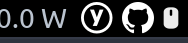

# xfce4 yubikey-touch-detector plugin

This repository offers a reader daemon script for
[yubikey-touch-detector](https://github.com/maximbaz/yubikey-touch-detector), which writes status data in format
compatible with [xfce4-genmon-plugin](https://docs.xfce.org/panel-plugins/xfce4-genmon-plugin) plugin, so you can see if your YubiKey is waiting for a touch on your Xfce panel.

## Screenshots

When YubiKey is pending the touch:


And when it's not pending:



## Installation

Make sure you have [yubikey-touch-detector](https://github.com/maximbaz/yubikey-touch-detector) installed and
running before proceeding.

```sh
mkdir -p ~/.local/bin/
cp ./yubikey-touch-detector-status-writer ~/.local/bin/
mkdir -p ~/.config/systemd/user
cp ./yubikey-touch-detector-status.service ~/.config/systemd/user/

systemctl --user daemon-reload
systemctl --user enable --now yubikey-touch-detector-status.service
```

Once running, add new `xfce4-genmon-plugin` to your panel and configure it to run the following command:

```sh
cat .cache/yubikey-touch-detector-status/current
```
